<!-- SLIDE 01 -->
<!-- .slide: class="title-slide" data-background-gradient="radial-gradient(circle at 78% 30%, rgba(214,227,106,.16), transparent 32%), linear-gradient(120deg, #151216 0%, #211a23 58%, #2b1d2f 100%)" -->

# AI agents for research

## Simulations, experimental automation, and visualisation

### What was unimaginable half a year ago is now simply a must

Egor Manuylovich 
Aston Institute of Photonic Technologies 
Aston University

Note:
Introduce the three research workflows and the common human-agent operating model.

[Sources]
- Content adapted from the speaker's private earlier AI agents for research presentation.
- Blender section adapted from the speaker's published Coding agents + Blender MCP talk.
[/Sources]

---

<!-- SLIDE 02 -->
<!-- .slide: class="poster-slide" -->

Before we begin

# This talk is a little different

  

    
It is not about our latest research.

    
It is about <strong>transferable skills for researchers</strong>: using AI agents across simulation, experiments, and visualisation.

    

      For our recent research
      <strong>Visit Luca's poster today</strong>
    

    
And now, let us proceed with this talk.

  

  <figure class="poster-figure">
    
  </figure>

Note:
This talk is a little different from the research talks earlier today. It is not about our latest results, but about transferable skills for researchers. To hear about our recent work, please visit Luca's poster today. Then transition: and now, let us proceed with this talk.

[Sources]
- https://www.nature.com/articles/s41467-026-75602-8
[/Sources]

---

<!-- SLIDE 03 -->

# What this talk is about

  
01<strong>Coding agents</strong><small>What changes when software can act in its own loop</small>

  
02<strong>Scientific simulations</strong><small>From fast prompting to specifications and tests</small>

  
03<strong>Experimental automation</strong><small>Building software to help you automate experiments</small>

  
04<strong>Scientific visualisation</strong><small>Blender MCP and API for figures</small>

---

<!-- SLIDE 04 -->

# What are AI coding agents?

  
<strong>Chatbot</strong>Answers questions and generates code snippets on demand.<small>ChatGPT · Claude · Gemini</small>

  
<strong>Autocomplete</strong>Suggests code while you type, one line or block at a time.<small>Copilot · Cursor</small>

  
<strong>Agent</strong>Reads files, edits codebases, runs tests, sees errors, and iterates.<small>Codex · Claude Code · Cursor</small>

The key difference: an agent can inspect, act, observe the result, and revise.

---

<!-- SLIDE 05 -->

# AI-assisted simulations: what changes?

  

    <h3>Before</h3>
    <ul>
      <li>Slow, manual coding for simulations</li>
      <li>Fragmented scripts per use-case</li>
      <li>Manual plotting and formatting</li>
      <li>Documentation: too boring to write</li>
    </ul>
  

  

    <h3>With agents</h3>
    <ul>
      <li>Modular, reusable components</li>
      <li>Parameter sweeps generated quickly</li>
      <li>Plotting pipelines automated end-to-end</li>
      <li>Tests and documentation added early</li>
      <li>Faster hypothesis iteration</li>
    </ul>
  

The biggest gain is making previously "too-hard-to-be-feasible" software practical.

---

<!-- SLIDE 06 -->

# The research bottleneck is shifting

  IdeaModelCodeExperimentDataFigurePaper

Research is increasingly software-heavy: glue code, plotting, automation, interfaces, debugging, and data wrangling.

  
<strong>Agents reduce software friction.</strong> <small>Generate, test, refactor, document, and connect systems.</small>

  
<strong>Verification is often easier than construction.</strong> <small>But only when the researcher knows what must remain true.</small>

---

<!-- SLIDE 07 -->

# Examples from simulation work

  <figure>
    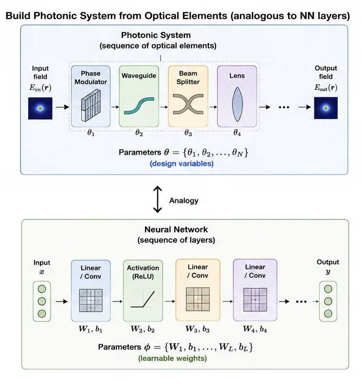
    <figcaption>Map photonic elements pytorch layers, optimise!</figcaption>
  </figure>
  <figure>
    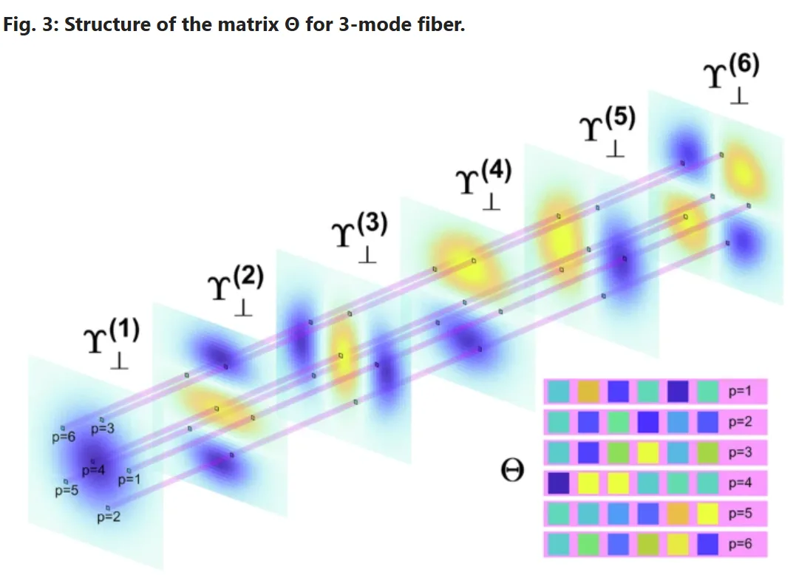
    <figcaption>Writing plotting script for this manually would be a nightmare!</figcaption>
  </figure>

The agent can translate your words in the actual code. You must define the physics and meaning.

---

<!-- SLIDE 08 -->

# Vibe coding

Fast prompting with minimal planning: “make me a simulator”, then iterate until it looks right.

  

    <h3>Good for</h3>
    <ul>
      <li>One-off scripts and quick plots</li>
      <li>Educational demonstrations</li>
      <li>Small GUIs and data explorers</li>
      <li>Fast hypothesis sketches</li>
    </ul>
  

  

    <h3>Risk</h3>
    <ul>
      <li>Hidden bugs that look plausible</li>
      <li>Hard-to-maintain code</li>
      <li>Poor reproducibility</li>
      <li>Difficult validation and extension</li>
    </ul>
  

Useful for short scripts; unpractical for more complex research software.

---

<!-- SLIDE 09 -->

# Where agents are good and where not

  

    <h3>Good at</h3>
    <ul>
      <li>APIs, wrappers, and boilerplate</li>
      <li>Plotting and interactive dashboards</li>
      <li>File handling and data pipelines</li>
      <li>Refactoring and documentation</li>
      <li>Writing and running tests</li>
    </ul>
  

  

    <h3>Weak at</h3>
    <ul>
      <li>Scientific correctness</li>
      <li>Hidden physical assumptions</li>
      <li>Numerical validity and stability</li>
      <li>Domain-specific conventions</li>
      <li>Physical intuition</li>
    </ul>
  

The researcher remains the scientific authority and is responsible for the result.

---

<!-- SLIDE 10 -->

# Vibe coding → spec-driven development

  requirements<i>→</i>equations<i>→</i>architecture<i>→</i>tests<i>→</i>implementation<i>→</i>validation

  
<strong>agent.md</strong>Physics, conventions, architecture, and expected behaviour.

  
<strong>Acceptance tests</strong>Define what correct output looks like before implementation.

  
<strong>Project structure</strong>Modular components let the agent work on isolated responsibilities.

  
<strong>Reproducibility</strong>Specs and version control make the work auditable and extensible.

---

<!-- SLIDE 11 -->

# Why specifications and tests matter in science

  
<strong>Physical assumptions</strong>Steady-state versus dynamic behaviour must be explicit.

  
<strong>Interferometer phase</strong>Reflection and transmission conventions change the result.

  
<strong>Propagation operator</strong>The phase-accumulation sign determines physical meaning.

  
<strong>Energy conservation</strong>Lossless limits must remain lossless.

  
<strong>Orthogonality</strong>Modal constraints must be built into the implementation.

  
<strong>Units</strong>Radians, degrees, nanometres, and micrometres cannot silently mix.

In research, “looks correct” is not sufficient.

---

<!-- SLIDE 12 -->

# Human-agent research loop

  

    <h3>Human</h3>
    <ul>
      <li>Defines the physics and mathematics</li>
      <li>Writes the specification</li>
      <li>Sets acceptance criteria and tests</li>
      <li>Checks physical meaning and edge cases</li>
    </ul>
  

  

    <h3>Agent</h3>
    <ul>
      <li>Creates project structure</li>
      <li>Implements modules from the specification</li>
      <li>Writes tests and runs sweeps</li>
      <li>Refactors, documents, and plots</li>
    </ul>
  

You do the science; the agent is your hard-working implementation partner.

---

<!-- SLIDE 13 -->

# Testing scientific software

  <blockquote>“If you cannot define a test, you probably do not yet understand the system.”</blockquote>
  

    conservation laws · symmetry and reciprocity · analytical benchmarks ----- Testing now is even more important!
  

  zero nonlinearity → linear propagation
  zero length → identity matrix
  lossless system → energy conservation
  symmetric beamsplitter → equal splitting
  phase wrap at 2π → field continuity
  degenerate modes → orthogonal eigenfunctions

---

<!-- SLIDE 14 -->
<!-- .slide: class="demo-slide" -->

Live demo 1

# AI-assisted simulation

Optical Circuit Lab

  specify<i>→</i>implement<i>→</i>test<i>→</i>inspect

---

<!-- SLIDE 15 -->

# The traditional lab software problem

  LaserOscilloscopeSLMCameraStagePower meter

  

    <h3>What researchers juggle</h3>
    <ul>
      <li>Different software for every instrument</li>
      <li>Manual clicking with no scripting</li>
      <li>Session-specific configuration</li>
    </ul>
  

  

    <h3>What experiments need</h3>
    <ul>
      <li>Synchronisation across devices</li>
      <li>Reproducible acquisition sequences</li>
      <li>Logging, errors, and recovery</li>
    </ul>
  

---

<!-- SLIDE 16 -->

# AI-generated lab orchestration software

  

    <h3>Interfaces already exist</h3>
    
SCPIVISASerialPython SDKRESTUSB HID

  

  

    <h3>Agents connect the pieces</h3>
    <ul>
      <li>Read vendor documentation and examples</li>
      <li>Write device wrappers</li>
      <li>Build a shared Python backend</li>
      <li>Generate dashboards and experiment sequences</li>
      <li>Add logging and error handling</li>
    </ul>
  

Instrument APIs are necessary; orchestration turns them into an experiment.

---

<!-- SLIDE 17 -->

# From orchestration to closed-loop experiments

  instrument control<i>→</i>measurement<i>→</i>analysis<i>→</i>optimiser<i>→</i>updated control

  <strong>phase stabilisation</strong>
  <strong>adaptive measurement</strong>
  <strong>Bayesian optimisation</strong>
  <strong>autonomous alignment</strong>

The output of analysis becomes the next experimental action.

---

<!-- SLIDE 18 -->

# Example: SLM and camera control software

  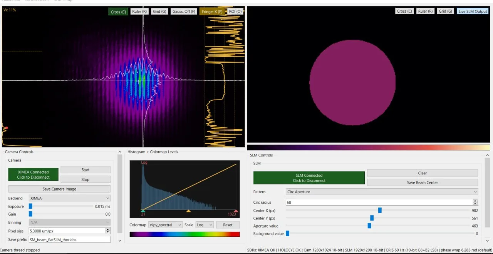

One interface coordinates live camera inspection, SLM patterns, acquisition settings, and saved data.

---

<!-- SLIDE 19 -->

# Real example: phase masks and calibration

  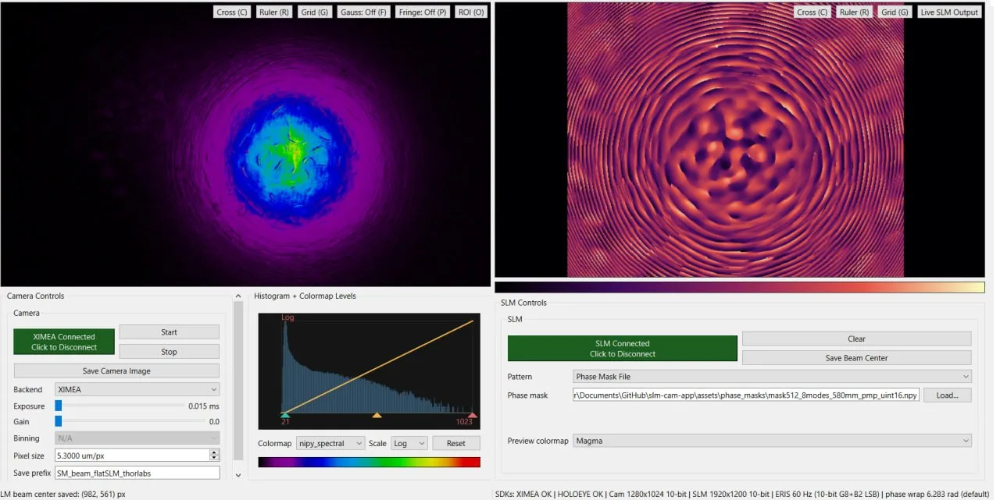

Manual alignment becomes a repeatable calibration and dataset-generation workflow.

---

<!-- SLIDE 20 -->
<!-- .slide: class="demo-slide" -->

Live demo 2

# Custom SLM-camera control

Lab orchestration and automatic dataset acquisition

  set pattern<i>→</i>acquire<i>→</i>analyse<i>→</i>save

---

<!-- SLIDE 21 -->

# Scientific visualisation matters

  

    
A scientific figure is part of the argument, not decoration added after the science.

    <ul>
      <li>Communicate the physical mechanism</li>
      <li>Guide the reader's intuition</li>
      <li>Look deliberate and unambiguous</li>
      <li>Remain reproducible from source files</li>
    </ul>
  

  <figure>
    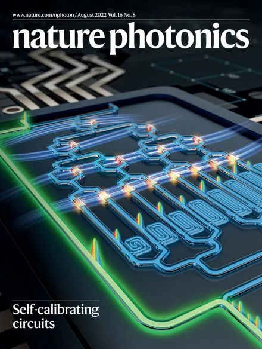
    <figcaption>Effective visualisation combines physical structure with a clear visual hierarchy.</figcaption>
  </figure>

---

<!-- SLIDE 22 -->

# The good, the bad and the ugly

  <figure>
    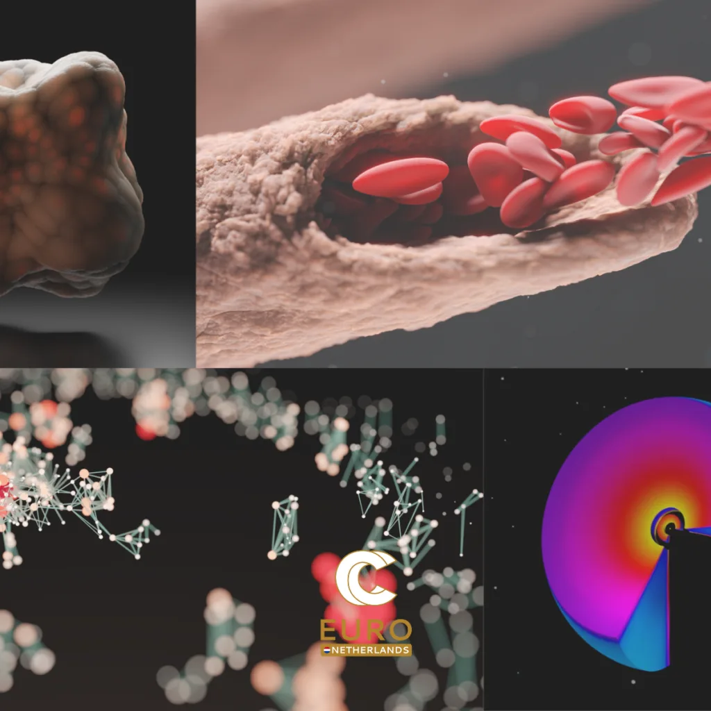
    <figcaption><strong>Good:</strong> compelling visual craft</figcaption>
  </figure>
  <figure>
    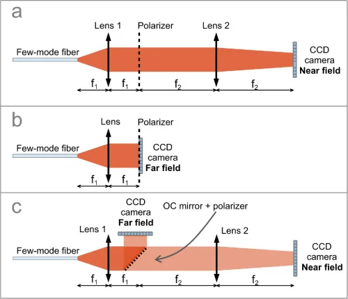
    <figcaption><strong>Bad:</strong> correct, clear, forgettable</figcaption>
  </figure>
  <figure>
    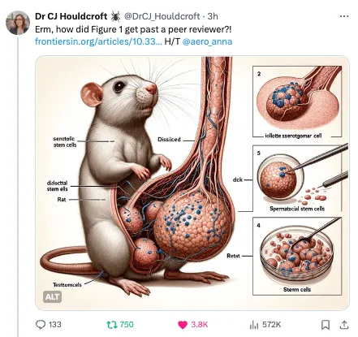
    <figcaption><strong>Ugly:</strong> polished appearance, broken science</figcaption>
  </figure>

We need both: scientific judgement and visual craft.

---

<!-- SLIDE 23 -->
<!-- .slide: class="hinge-slide" -->

# Three reasons Blender changes the calculation

  
01<strong>Blender is free</strong><small>Open-source, with no licence barrier.</small>

  
02<strong>Blender is scriptable</strong><small>A scene can be generated and revised through code.</small>

  
03<strong>Blender has MCP</strong><small>An agent can interact directly with the application.</small>

You do not need to become a professional 3D artist, but you must learn enough to inspect the result.

---

<!-- SLIDE 24 -->

# Coding agent + Blender MCP

  physical brief<i>→</i>coding agent<i>→</i>Blender MCP<i>→</i>scene and render<i>→</i>inspection

  

    
<strong>Model Context Protocol</strong> connects an AI application to external tools.

    
For Blender, those tools expose objects, materials, lights, cameras, scripts, scene inspection, and rendering.

  

  

    <small>In practical terms</small>
    <strong>language becomes tool calls</strong>
  

---

<!-- SLIDE 25 -->

# Brief it like a 3D artist and a physicist

  

    <ul class="instruction-list">
      <li><strong>Scientific story and source data</strong>What mechanism must the reader understand?</li>
      <li><strong>Physical constraints</strong>What geometry, convention, or implication must remain true?</li>
      <li><strong>Visual hierarchy</strong>What is the hero, and in what order should the scene be read?</li>
      <li><strong>Failure conditions</strong>What must the figure never imply?</li>
      <li><strong>Style and deliverables</strong>References, camera, aspect ratio, labels, and export format.</li>
    </ul>
  

  <figure class="prompting-figure">
    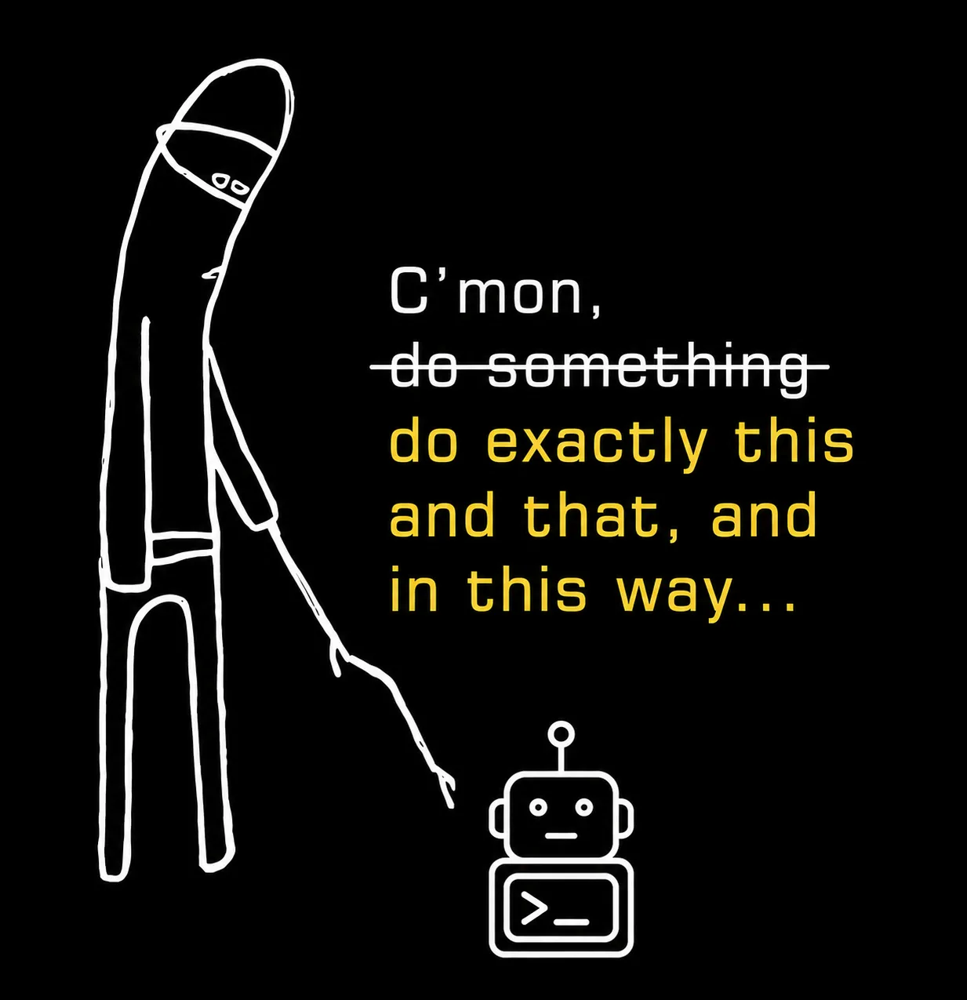
  </figure>

Ask the model to describe the scene and ask clarifying questions before it writes the specification.

---

<!-- SLIDE 26 -->

# From flat reference to one coherent scene

  <figure>
    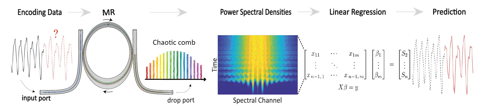
    <figcaption>Reference: accurate stages, weak spatial coherence</figcaption>
  </figure>
  <i>→</i>
  <figure>
    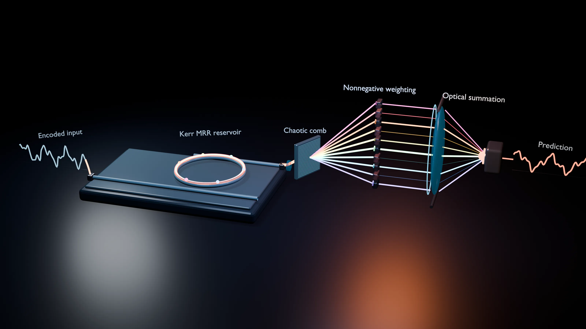
    <figcaption>Blender: one physical scene with an explicit reading order</figcaption>
  </figure>

Resolve the interpretation first: preserve the science, then choose the visual hero.

---

<!-- SLIDE 27 -->

# Let the agent work the visual loop

  

    <ol>
      <li>Give it the specification and references.</li>
      <li>Let it build through Blender MCP.</li>
      <li>Request preview renders and scene inspection.</li>
      <li>Correct one physical or visual issue at a time.</li>
    </ol>
    

      <small>Useful feedback</small>
      
“The attenuators must visibly reduce each outgoing beam's intensity.”

    

  

  <figure class="agent-screenshot">
    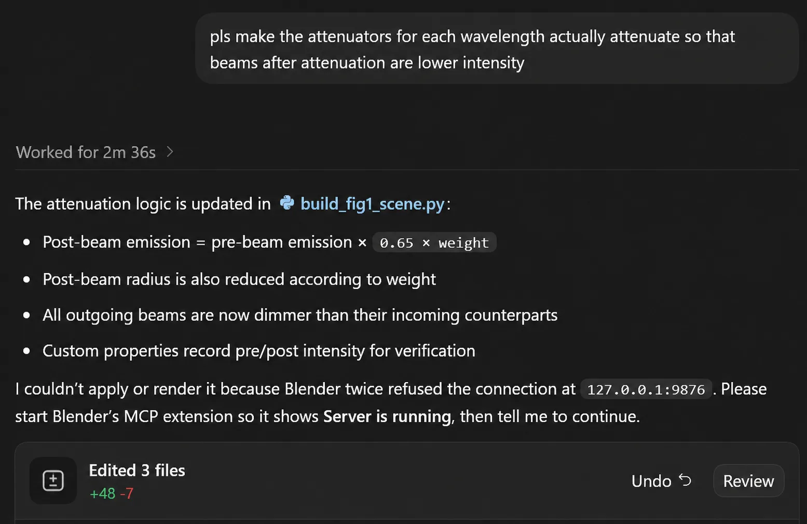
    <figcaption>A visual correction becomes a concrete scene and code change.</figcaption>
  </figure>

---

<!-- SLIDE 28 -->

# Feedback should sound like an art director and a physicist

  
“The spectrum looks continuous. Make the channels discrete.”

  
“The detector is too large. Restore the micro-ring as the hero.”

  
“Remove the external loop. Memory must be intracavity.”

  
“Make weighting visible through beam intensity.”

  <strong>domain meaning</strong>
  <strong>visual diagnosis</strong>
  <strong>failure criterion</strong>
  <strong>next action</strong>

Be specific: vague input produces vague geometry.

---

<!-- SLIDE 29 -->

# Replace decoration with real data

  

    
Give the agent:

    <ul>
      <li>measured spectra</li>
      <li>simulated field profiles</li>
      <li>device dimensions</li>
      <li>intensity traces</li>
      <li>exact export constraints</li>
    </ul>
    
The scene can carry scientific information, not just scientific aesthetics.

  

  <figure class="real-data-figure">
    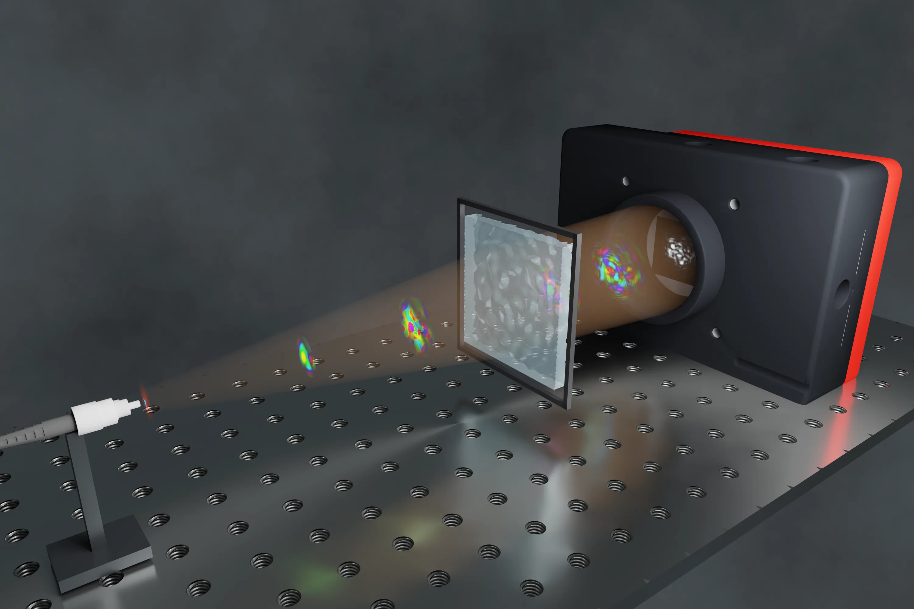
    <figcaption>Field data embedded directly in the rendered optical path</figcaption>
  </figure>

---

<!-- SLIDE 30 -->

# Practical advice for researchers

  
1<strong>Learn basic Python, Git, and enough Blender to inspect results.</strong>

  
2<strong>Start with one small, well-defined tool or scene.</strong>

  
3<strong>Write the specification before implementation.</strong>

  
4<strong>Always ask for tests and explicit failure conditions.</strong>

  
5<strong>Validate every output against physics and known limits.</strong>

  
6<strong>Keep specifications, code, scenes, and results under version control.</strong>

---

<!-- SLIDE 31 -->

# Limits and pitfalls

  

    <h3>Risks</h3>
    <ul>
      <li>Plausible but incorrect code</li>
      <li>Hidden physical assumptions</li>
      <li>Convincing but wrong geometry</li>
      <li>Weak reproducibility</li>
      <li>Over-trust in demo outputs</li>
    </ul>
  

  

    <h3>Mitigation</h3>
    <ul>
      <li>Write specifications before building</li>
      <li>Define tests that can fail</li>
      <li>Validate against analytical limits</li>
      <li>Commit everything to version control</li>
      <li>Treat agent output as a first draft</li>
    </ul>
  

Plausible wrongness is more dangerous than obvious failure.

---

<!-- SLIDE 32 -->
<!-- .slide: class="closing-slide" data-background-gradient="radial-gradient(circle at 25% 80%, rgba(189,164,255,.18), transparent 34%), radial-gradient(circle at 78% 22%, rgba(214,227,106,.16), transparent 34%), #151216" -->

# (Domain) expertise is now even more valuable than before

  

    
Agents amplify whatever skill level the researcher brings.

    
Specify precisely. Delegate implementation. Validate scientifically.

    
As always: garbage in → garbage out.

  

  

    
    <strong>Scan for the full presentation</strong>
    egor-manu.github.io/<wbr>ai-agents-for-research-talk
  

Note:
Close on responsibility: agents expand the feasible scope of research software and visualisation, but scientific authority remains human. Keep this slide visible while the audience scans the QR code.
