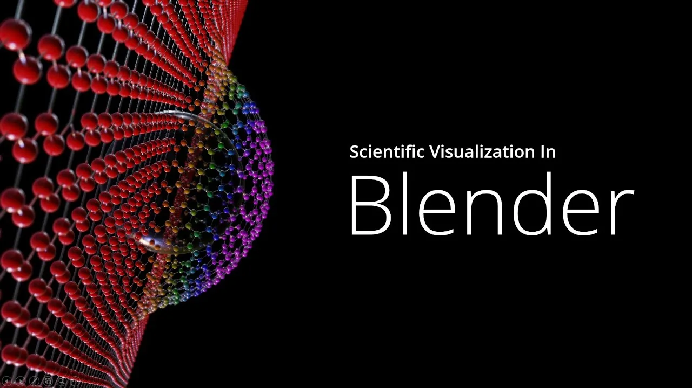

<!-- SLIDE 01 -->
<!-- .slide: class="title-slide" data-background-image="assets/images/hero.webp" data-background-size="cover" data-background-position="center" -->

# AI agents for research:

## simulations, experimental automation, and visualisation

  <strong>Egor Manuylovich</strong>
  Aston Institute of Photonic Technologies
  Aston University

Note:
This talk connects three research workflows through one human-agent operating model.

[Sources]
- Visual and copy adapted from the speaker's earlier AI agents for research deck in `references/`.
[/Sources]

---

<!-- SLIDE 02 -->

The change

# The research bottleneck has moved

  IdeaModelCodeExperimentDataFigurePaper

More research time is spent on software between the scientific steps: setup, integration, debugging, automation, plotting, and documentation.

Agents make previously uneconomic research software practical, but only when scientific validation remains explicit.

Note:
Use the chain to show that agents do not replace theory or experiment; they reduce friction between them.

[Sources]
- Speaker's earlier AI agents for research deck, slides 4-5.
[/Sources]

---

<!-- SLIDE 03 -->

What is different

# An agent is software inside its own work loop

  read context<i>&rarr;</i>act<i>&rarr;</i>observe<i>&rarr;</i>revise

  

    <h3>Chatbot</h3>
    
Answers a prompt and returns code or advice.

  

  

    <h3>Agent</h3>
    
Reads files, edits a project, runs tools and tests, sees failures, and iterates.

  

The important shift is from generating snippets to changing and checking a working system.

Note:
Keep the definition operational. The tool loop matters more than branding or model names.

[Sources]
- Speaker's earlier AI agents for research deck, slide 3.
- Speaker's Blender agents talk, conceptual agent loop.
[/Sources]

---

<!-- SLIDE 04 -->

Division of labour

# The researcher keeps scientific authority

  

    <h3>Researcher</h3>
    <ul>
      <li>Defines the physics and assumptions</li>
      <li>Sets tests and acceptance criteria</li>
      <li>Interprets outputs and edge cases</li>
      <li>Decides what counts as evidence</li>
    </ul>
  

  

    <h3>Agent</h3>
    <ul>
      <li>Builds modules and interfaces</li>
      <li>Runs tests and parameter sweeps</li>
      <li>Refactors, documents, and plots</li>
      <li>Repeats mechanical feedback loops</li>
    </ul>
  

You do the science. The agent increases the speed and scope of implementation.

Note:
Scientific responsibility cannot be delegated to a system that does not know which hidden assumptions matter.

[Sources]
- Speaker's earlier AI agents for research deck, slides 8 and 11.
[/Sources]

---

<!-- SLIDE 05 -->

The talk

# Three domains, one operating model

  
<strong>Simulations</strong>Turn equations and conventions into tested software.

  
<strong>Automation</strong>Turn device APIs into reproducible experiments.

  
<strong>Visualisation</strong>Turn scientific structure and data into inspectable scenes.

In every case: specify clearly, let the agent work, and validate against reality.

Note:
This is the organising thesis for the rest of the talk.

[Sources]
- Synthesis of the speaker's two earlier talks.
[/Sources]

---

<!-- SLIDE 06 -->
<!-- .slide: class="section-slide section-sim" -->

01

# Simulations

When code becomes part of the model, tests become part of the science.

Note:
Section transition.

[Sources]
- Speaker's earlier AI agents for research deck, simulation section.
[/Sources]

---

<!-- SLIDE 07 -->

Scientific software

# Simulation code is part of the scientific instrument

  

    
An agent can build the machinery quickly. It cannot decide whether the machinery expresses the right physics.

    <ul>
      <li>Equations and approximations</li>
      <li>Units and sign conventions</li>
      <li>Boundary and limiting cases</li>
      <li>Numerical stability</li>
    </ul>
  

  <figure class="full-figure">
    
    <figcaption>Example photonic system used as a simulation target</figcaption>
  </figure>

Note:
Frame simulation code as an experimental apparatus: it requires calibration and known checks.

[Sources]
- System diagram embedded in the speaker's earlier AI agents for research deck.
[/Sources]

---

<!-- SLIDE 08 -->

Use the right mode

# Fast prompting is useful only when failure is cheap

  

    <h3>Useful for exploration</h3>
    <ul>
      <li>One-off scripts and plots</li>
      <li>Educational demonstrations</li>
      <li>Interface sketches</li>
      <li>Early hypothesis exploration</li>
    </ul>
  

  

    <h3>Unsafe as a final method</h3>
    <ul>
      <li>Hidden bugs can look plausible</li>
      <li>Assumptions remain undocumented</li>
      <li>Iteration becomes harder to reproduce</li>
      <li>Correctness is judged by appearance</li>
    </ul>
  

Use rapid prompting to discover the problem. Use specifications and tests to produce research software.

Note:
Avoid dismissing vibe coding completely; it is a useful exploratory mode with a clear boundary.

[Sources]
- Speaker's earlier AI agents for research deck, slides 7-9.
[/Sources]

---

<!-- SLIDE 09 -->

Specification

# A specification turns intent into checkable physics

  
<strong>Model</strong>Governing equations and the physical regime.

  
<strong>Conventions</strong>FFT sign, phase, coordinates, units, and normalisation.

  
<strong>Architecture</strong>Modules, interfaces, data flow, and saved artefacts.

  
<strong>Acceptance</strong>Analytical limits, conservation laws, and tolerances.

  requirements<i>&rarr;</i>physics<i>&rarr;</i>tests<i>&rarr;</i>implementation<i>&rarr;</i>validation

Note:
The specification is an external memory for both the human and the agent.

[Sources]
- Speaker's earlier AI agents for research deck, slides 9-10.
[/Sources]

---

<!-- SLIDE 10 -->

Tests as scientific statements

# A test should say what must remain true

  
<b>01</b>Zero nonlinearity produces linear propagation.

  
<b>02</b>Zero length produces the identity transfer matrix.

  
<b>03</b>A lossless system conserves energy.

  
<b>04</b>A symmetric beamsplitter splits equally.

  
<b>05</b>A phase wrap at 2&pi; preserves field continuity.

If you cannot define a failure condition, you probably do not yet understand the system well enough to delegate it.

Note:
These tests are compact expressions of physical understanding, not merely software hygiene.

[Sources]
- Speaker's earlier AI agents for research deck, slide 14.
[/Sources]

---

<!-- SLIDE 11 -->

Debugging

# Agents accelerate debugging and create new failure modes

  
<strong>Beamsplitter convention</strong> reflection and transmission phases differ.

  
<strong>Arm-length sum vs difference</strong> a plausible formula can encode the wrong geometry.

  
<strong>Propagation sign</strong> a sign change reverses the physical interpretation.

  
<strong>Unit mismatch</strong> nm, &micro;m, radians, and degrees mix silently.

  
<strong>Numerical instability</strong> a smooth plot can hide a failing method.

Plausible wrongness is more dangerous than an obvious crash.

Note:
The agent's speed increases the need for fast, targeted scientific checks.

[Sources]
- Speaker's earlier AI agents for research deck, slide 13.
[/Sources]

---

<!-- SLIDE 12 -->

Workflow

# A useful simulation loop separates building from believing

  
<strong>1. Specify physics</strong>Equations, assumptions, conventions, and known limits.

  
<strong>2. Implement and test</strong>Modules, unit tests, physical checks, and benchmark cases.

  
<strong>3. Sweep and interpret</strong>Parameter studies, plots, human interpretation, and revised assumptions.

<figure class="full-figure">
  
  <figcaption>Concrete system structure makes a useful benchmark for generated code</figcaption>
</figure>

Note:
The researcher can revise the specification when the outputs reveal an incomplete assumption.

[Sources]
- Speaker's earlier AI agents for research deck, slides 6 and 12.
[/Sources]

---

<!-- SLIDE 13 -->

Case study

# Optical Circuit Lab makes the model inspectable

  

    
A reusable simulator is more valuable than a single successful plot.

    <ul>
      <li>Explicit optical components</li>
      <li>Analytical benchmark cases</li>
      <li>Interactive parameter changes</li>
      <li>Plots generated from one data path</li>
    </ul>
  

  

    <h3>The agent's contribution</h3>
    
Architecture, implementation, tests, interface, refactoring, and documentation.

    <h3>The researcher's contribution</h3>
    
Physical conventions, acceptance criteria, interpretation, and approval.

  

Note:
Prepare the local demo before presenting. Keep static screenshots available as a fallback.

[Sources]
- Speaker's earlier AI agents for research deck, live demo 1.
[/Sources]

---

<!-- SLIDE 14 -->
<!-- .slide: class="demo-slide" -->

Live demo 1

# A simulator that can be tested

Change a physical parameter, inspect the generated result, then run a known limiting case that can fail.

  change<i>&rarr;</i>predict<i>&rarr;</i>run<i>&rarr;</i>check

Note:
Demonstrate scientific validation, not just interface fluency.

[Sources]
- Speaker's Optical Circuit Lab demonstration.
[/Sources]

---

<!-- SLIDE 15 -->
<!-- .slide: class="section-slide section-auto" -->

02

# Experimental automation

When device control becomes software, the experiment becomes reproducible and composable.

Note:
Section transition.

[Sources]
- Speaker's earlier AI agents for research deck, experimental automation section.
[/Sources]

---

<!-- SLIDE 16 -->

The lab software problem

# Instrument APIs are necessary but not sufficient

  LaserOscilloscopeSLM
  CameraMotion stagePower meter

  
<h3>What exists</h3>
Each instrument usually exposes a programmable interface.

  
<h3>What is missing</h3>
A shared data model, synchronisation, error handling, and repeatable workflows.

Note:
The core problem is integration, not a lack of vendor APIs.

[Sources]
- Speaker's earlier AI agents for research deck, slide 16.
[/Sources]

---

<!-- SLIDE 17 -->

Agent leverage

# Agents can turn vendor interfaces into a shared backend

  SCPI / VISASerial / RS-232Python SDK
  REST APIUSB HIDFile protocol

The repeatable work is exactly where an agent helps: read examples, write wrappers, connect interfaces, add tests, and document behaviour.

The research-specific part remains the timing, safety, calibration, and meaning of each measurement.

Note:
Vendor examples are often fragmented. Agents are effective at turning them into consistent wrappers.

[Sources]
- Speaker's earlier AI agents for research deck, slide 17.
[/Sources]

---

<!-- SLIDE 18 -->

Reproducibility

# Orchestration turns a sequence of clicks into an experiment

  configure<i>&rarr;</i>acquire<i>&rarr;</i>analyse<i>&rarr;</i>log

  
<strong>State</strong>Record every device setting and software version.

  
<strong>Timing</strong>Make synchronisation and waits explicit.

  
<strong>Failure</strong>Recover safely from timeouts and partial runs.

  
<strong>Data</strong>Save measurement, metadata, and analysis together.

Note:
The value is not merely convenience. The workflow becomes inspectable, repeatable, and reviewable.

[Sources]
- Synthesis of the speaker's automation case study.
[/Sources]

---

<!-- SLIDE 19 -->

Closed loop

# Analysis can become the next experimental action

  control<i>&rarr;</i>measurement<i>&rarr;</i>analysis<i>&rarr;</i>optimiser<i>&rarr;</i>updated control

<ul>
  <li>Phase stabilisation and active correction</li>
  <li>Adaptive measurement where uncertainty is highest</li>
  <li>Bayesian optimisation of experimental parameters</li>
  <li>Automated alignment or mode matching</li>
</ul>

Closing the loop changes the experiment, so guardrails and stopping conditions must be part of the specification.

Note:
Do not imply full autonomy is always desirable. Emphasise explicit bounds and safe failure.

[Sources]
- Speaker's earlier AI agents for research deck, slide 18.
[/Sources]

---

<!-- SLIDE 20 -->

Real interface

# One interface can coordinate SLM and camera

<figure class="full-figure">
  
  <figcaption>Custom software for SLM-camera calibration and automated dataset acquisition</figcaption>
</figure>

The interface is useful because it sits on top of one programmable, testable backend.

Note:
Point out the live camera view, generated SLM pattern, and acquisition controls.

[Sources]
- Speaker-created SLM-camera control software screenshot from the earlier deck.
[/Sources]

---

<!-- SLIDE 21 -->

Calibration as data

# Calibration becomes a repeatable data product

<figure class="full-figure">
  
  <figcaption>Measured optical field and generated phase mask captured in the same workflow</figcaption>
</figure>

Automation preserves the relationship between settings, measurements, analysis, and generated control patterns.

Note:
Contrast this with manually saving screenshots or rebuilding the calibration by memory.

[Sources]
- Speaker-created phase-mask calibration screenshot from the earlier deck.
[/Sources]

---

<!-- SLIDE 22 -->
<!-- .slide: class="demo-slide" -->

Live demo 2

# Automatic SLM-camera acquisition

Run a short acquisition sequence and show that device state, measurement, and generated mask remain linked.

  set mask<i>&rarr;</i>capture<i>&rarr;</i>analyse<i>&rarr;</i>save provenance

Note:
Use a short deterministic sequence. Keep the previous screenshots available if hardware is unavailable.

[Sources]
- Speaker's SLM-camera laboratory demonstration.
[/Sources]

---

<!-- SLIDE 23 -->
<!-- .slide: class="section-slide section-viz" -->

03

# Scientific visualisation

A figure should make the physical mechanism easier to reason about, not merely look impressive.

Note:
Section transition into the expanded material from the Blender agents talk.

[Sources]
- Speaker's Coding agents and Blender MCP for scientific figures talk.
[/Sources]

---

<!-- SLIDE 24 -->

Why it matters

# Scientific visualisation is part of the reasoning

  

    
A strong figure communicates mechanism, scale, relationships, and uncertainty before the reader reaches the caption.

    <ul>
      <li>Scientifically exact</li>
      <li>Visually deliberate</li>
      <li>Unambiguous</li>
      <li>Revisable from source</li>
    </ul>
  

  <figure class="full-figure">
    
    <figcaption>High-impact scientific illustration combines explanation and visual hierarchy</figcaption>
  </figure>

Note:
Separate aesthetic polish from scientific accuracy; the best figures need both.

[Sources]
- Nature Photonics cover reproduced in the speaker's earlier deck for educational discussion.
- Speaker's Blender agents talk, slides 3-6.
[/Sources]

---

<!-- SLIDE 25 -->

The skills bottleneck

# Blender solves the rendering problem, but introduces another profession

  <figure>
    
    <figcaption>Powerful geometry, materials, lighting, and rendering</figcaption>
  </figure>
  <figure>
    
    <figcaption>Scientific content alone does not guarantee visual clarity</figcaption>
  </figure>

Researchers need a way to express scientific intent without becoming full-time 3D artists.

Note:
Blender is not difficult because it is badly designed; it is difficult because 3D design is a real discipline.

[Sources]
- Blender interface and published-example images embedded in the speaker's earlier decks.
[/Sources]

---

<!-- SLIDE 26 -->

Agent + tool

# MCP gives the agent handles on the 3D scene

  

    

      text specification<i>&rarr;</i>agent<i>&rarr;</i>Blender API<i>&rarr;</i>render
    

    <ul>
      <li>Geometry and object hierarchy</li>
      <li>Materials, lighting, and camera</li>
      <li>Data-driven meshes and textures</li>
      <li>Saved scenes, renders, and revisions</li>
    </ul>
  

  

    <small>Model Context Protocol</small>
    <strong>not more intelligence, more useful access</strong>
  

The agent can operate Blender's scriptable scene graph and inspect the result through rendered images.

Note:
Explain MCP as a standard route to tools and context, not as magic.

[Sources]
- Speaker's Blender agents talk, slides 10-13.
[/Sources]

---

<!-- SLIDE 27 -->

The brief

# Brief the agent like a 3D artist and a physicist

  

    <ol class="instruction-list">
      <li>Describe what the scene must explain.</li>
      <li>Specify geometry, scale, and coordinate conventions.</li>
      <li>State what must be driven by real data.</li>
      <li>Define camera, lighting, and visual hierarchy.</li>
      <li>Ask for questions before implementation.</li>
    </ol>
  

  <figure class="full-figure">
    
    <figcaption>A useful specification is concrete enough to fail</figcaption>
  </figure>

Note:
The brief should encode both the physical scene and the communication job of the figure.

[Sources]
- Speaker's Blender agents talk, slides 14-19.
[/Sources]

---

<!-- SLIDE 28 -->

The visual loop

# The useful loop is inspect, specify, render, critique

  <figure>
    
    <figcaption>Start by identifying the physical relationships in the reference</figcaption>
  </figure>
  <figure>
    
    <figcaption>The agent edits the scene and returns a render for review</figcaption>
  </figure>

  inspect<i>&rarr;</i>specify<i>&rarr;</i>render<i>&rarr;</i>critique

Note:
Feedback should sound like an art director and a physicist: identify the visual defect and why it changes interpretation.

[Sources]
- Speaker's source figure and Codex-Blender workflow screenshot.
[/Sources]

---

<!-- SLIDE 29 -->

Combined reasoning

# The agent can work on physics and graphics together

  

    
One instruction can connect a physical correction to a graphical change.

    

      
"The field should expand after the phase element. Move the waist, reverse the propagation cue, and keep the detector plane fixed."

    

    
The researcher still checks whether the corrected scene expresses the intended physics.

  

  <figure class="full-figure">
    
    <figcaption>One coherent, revisable 3D scene</figcaption>
  </figure>

Note:
This is the distinctive benefit of a coding agent controlling a scriptable graphics environment.

[Sources]
- Speaker-created Blender scene from the earlier AI agents for research deck.
[/Sources]

---

<!-- SLIDE 30 -->

Data-driven figures

# Replace decorative geometry with real data

  <figure>
    
    <figcaption>A schematic can explain topology without showing the measured field</figcaption>
  </figure>
  <figure>
    
    <figcaption>Measured or simulated arrays can drive geometry, texture, colour, and labels</figcaption>
  </figure>

The figure becomes reproducible when the scene, data, and script are versioned together.

Note:
Give examples: intensity maps as textures, trajectories as curves, uncertainty as geometry, and arrays as object placement.

[Sources]
- Speaker's Blender agents talk, data-driven visualisation example.
- Reference optical figure retained in `references/source_paper_PRR_2025.pdf`.
[/Sources]

---

<!-- SLIDE 31 -->

Shared risk

# Plausible wrongness is the failure mode in all three domains

  

    <h3>Risks</h3>
    <ul>
      <li>Incorrect equations that produce smooth plots</li>
      <li>Unsafe device sequences that appear to run</li>
      <li>Convincing geometry that encodes wrong physics</li>
      <li>Weak provenance after rapid iteration</li>
    </ul>
  

  

    <h3>Mitigation</h3>
    <ul>
      <li>Write specifications before production work</li>
      <li>Define tests that can fail</li>
      <li>Compare against known limits and measurements</li>
      <li>Version the spec, code, data, and outputs together</li>
    </ul>
  

Note:
Connect the same validation mindset across simulation, automation, and visualisation.

[Sources]
- Speaker's earlier AI agents for research deck, slide 27.
[/Sources]

---

<!-- SLIDE 32 -->

How to start

# Begin with one small workflow you can verify

  
01
<strong>Choose a bounded task</strong><small>One model, one instrument, or one figure.</small>

  
02
<strong>Write the scientific contract</strong><small>Assumptions, inputs, outputs, conventions, and failure conditions.</small>

  
03
<strong>Ask the agent to propose a plan</strong><small>Resolve questions before implementation.</small>

  
04
<strong>Make validation executable</strong><small>Tests, benchmark data, safe states, or visual comparisons.</small>

  
05
<strong>Keep reproducible records</strong><small>Version the specification, code, data, scene, and decisions.</small>

Note:
This is the audience's practical takeaway. It should feel achievable on the next working day.

[Sources]
- Speaker's earlier AI agents for research deck, slide 26.
- Speaker's Blender agents talk, final practical guidance.
[/Sources]

---

<!-- SLIDE 33 -->
<!-- .slide: class="closing-slide" -->

Takeaway

# AI does not remove the need for expertise. It raises its value.

Agents amplify the researcher's ability to build systems, run loops, and explore alternatives. Domain knowledge determines what to specify, what to test, and when not to trust the result.

Specify clearly. Automate deliberately. Validate scientifically.

egor-manu.github.io/ai-agents-for-research-talk/

Note:
Resolve the opening: agents reduce software friction, while scientific expertise remains the authority.

[Sources]
- Synthesis of the speaker's two earlier talks.
[/Sources]

